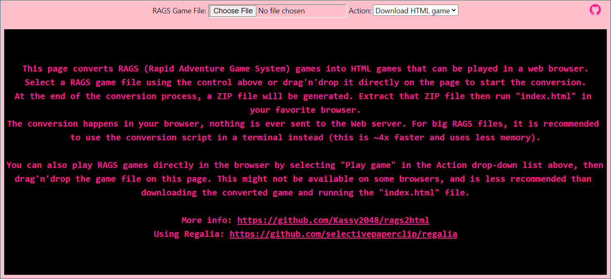

# RAGS to HTML
Rags2Html is a tool to convert RAGS (*Rapid Adventure Game System*) games into HTML games, without having to use RAGS at all for the conversion. The tool is able to extract the game data from any RAG files, and then convert it into a format suitable for playing the games in a Web browser. The Web engine is a (slightly) modified version of [Regalia](https://github.com/selectivepaperclip/regalia) which is an improved version of the original Web engine that comes with RAGS.

The conversion has been successfully tested on ~100 games from different versions of RAGS. If it fails for a specific game, [open an issue](https://github.com/Kassy2048/rags2html/issues) with a link to download the game file.

## How to use

### Online version



This is the easiest solution, but it may not work for very large games, as it requires the full game content to be loaded twice into memory. It will probably only work from desktop computers (not mobile devices).

1. Go to the online version [here](https://kassy2048.github.io/rags2html/).
2. Drag and drop the RAGS game file onto the page or use the "Choose File" button.
3. Wait for the game to be converted, then download the resulting ZIP file.
4. Extract the ZIP file to a location on your computer.
5. Double click on the file "index.html" and enjoy your game!

### Command line
To run the tool from the command line, you need to have Python 3 installed.

1. Download the files from this repository [here](https://github.com/Kassy2048/rags2html/archive/refs/heads/master.zip) or clone it with Git.
2. Open a terminal window.
3. Install the crypto library that is required to decrypt RAG files using the following command:
```
python3 -m pip install cryptography
```
4. Run the tool with the following command, replacing `<filepath>` with the path to the RAGS game file (multiple files can be given):
```
python3 rags2html.py <filepath>
```
5. In the folder where the RAGS game file is located, a new subfolder named after this file has been created. Open the file "index.html" in this subfolder and enjoy your game!

The tool can accept some additional command switches, which are mainly used for debugging purposes:
```
usage: rags2html.py [-h] [--skip-media] [-t TRACE] [--data-debug] [--info] [--decrypt-only] [--rags-compat] rag_file [rag_file ...]

Convert RAG files into HTML game

positional arguments:
  rag_file

optional arguments:
  -h, --help            show this help message and exit
  --skip-media          do not extract media files
  -t TRACE, --trace TRACE
                        trace history size (default: 0)
  --data-debug          create debug JS files in the "data" folder
  --info                only show game info
  --decrypt-only        only decrypt the game file (for debugging)
  --rags-compat         produce JS code as close as what RAGS produces
```
## RAGS file format
RAGS has used two different file formats to store game data. Both contain the same kind of information about rooms, characters, items, timers, media files (images, movies, ...) and the player.

RAGS files can be protected with a password to prevent them from being opened with the RAGS Designer tool. Early versions of RAGS stored this password directly in the game file, and the designer compared it with what the user gave. Later versions only stored a hash representation of the password to prevent it from being leaked.

### .**N**ET **R**emoting: **B**inary **F**ormat (NRBF)
This format was used in early versions of RAGS (perhaps before 1.7). It contains a serialization of the internal classes used by the game, using the [BinaryFormatter class](https://learn.microsoft.com/en-us/dotnet/api/system.runtime.serialization.formatters.binary.binaryformatter). The format is [fully documented](https://learn.microsoft.com/en-us/openspecs/windows_protocols/ms-nrbf/75b9fe09-be15-475f-85b8-ae7b7558cfe5) and several open source parsers are available for it. The parser used by rag2html is based on the code from [nneonneo/net-nrbf](https://github.com/nneonneo/net-nrbf), with some changes to support more types and allow conversion to Python data structures (changes are in [Kassy2048/net-nrbf](https://github.com/Kassy2048/net-nrbf)).

This file is encrypted using AES-256-CBC with a hard-coded key and IV.

RAGS has to load the entire contents of the file into memory in order to use it, which affects the load time of the game and limits the number of media files that can be used. This is probably the reason why newer versions of RAGS use a different file format.

### Microsoft **S**QL Server CE **D**atabase **F**ile (SDF)
Later versions of RAGS use this file format which contains a lightweight representation of a Microsoft SQL database. This file format is undocumented and this project probably contains the first open source parser for it. It does not support all features of this file format (in particular, B-TREE pages and indexes are not supported), since the main goal was to support files generated by RAGS. Also, some assumptions and heuristics in this parser may be wrong, as the format has been reversed with lots of trials and errors. For more information, see the `sdf.py` file.

Each page (4096 bytes) in this file can be encrypted using AES-128-CBC with a different key for each page. This key is derived from a global key and the page data checksum. For RAGS, two different global keys have been used in the different RAGS versions.

RAGS relies on Microsoft SQL Server Compact 3.5 to access the contents of these files. Early versions of RAGS required the user to install this separately, but later versions did include the necessary DLLs.